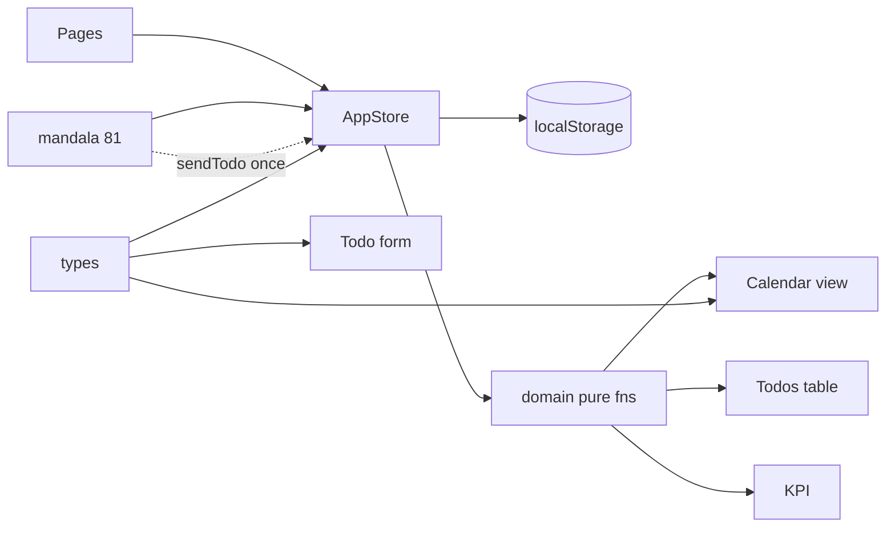

# Eng Plan · DeskList (잠금)

기준: [`mvp-scope.md`](./mvp-scope.md) · [`specs/mvp-backlog.md`](./specs/mvp-backlog.md) · 목업 `mockups/js/store.js`  
**상태:** T0–T9 완료 (패리티 QA PASS · 2026-09-15)

---

## 스택 (잠금)

| 항목 | 결정 |
|------|------|
| UI | React 19 + Vite + TypeScript |
| 라우팅 | React Router (`/`, `/calendar`, `/todos`, `/mandalart`, `/settings`) — `/`는 달력 또는 인덱스 리다이렉트 |
| 스타일 | `mockups/css/tokens.css` + `mock.css` → `src/styles/` (E+B). 컴포넌트 라이브러리 없음 |
| 상태 | 단일 `AppStore` (Context + `useSyncExternalStore` 또는 동등) |
| 영속 | `localStorage` 키 `desklist/v1` · `version: 1` |
| 날짜 | `YYYY-MM-DD` 문자열 + 네이티브 `Date` |
| 테스트 | 도메인 순수함수 Vitest (표시/상태/필터/monthCells) · UI는 T9 수동 |

앱 루트: 저장소 루트 (`docs/`, `mockups/` 유지).

---

## 데이터 모델 (잠금)

```ts
type Priority = "높음" | "중간" | "낮음";
type Status = "시작전" | "진행중" | "완료";
type WeekStartsOn = "sun" | "mon";

type Todo = {
  id: string;
  type: string;       // types[].name
  date: string;       // YYYY-MM-DD
  category: string;
  priority: Priority;
  title: string;
  progress: number;   // 0–100 integer
  note: string;
};

type TypeSetting = { name: string; icon: string };

type Filters = {
  dates: string[];      // [] = 전체 날짜
  types: string[];      // [] = 매칭 없음
  priorities: Priority[];
  categories: string[];
  statuses: Status[];
};

type AppState = {
  version: 1;
  types: TypeSetting[];
  todos: Todo[];
  filters: Filters;
  weekStartsOn: WeekStartsOn;  // ★ 단일 소스 (달력·주간 공유) — T8 반영
  calendar: { year: number; month: number; density: 8 | 16 };
  week: { year: number; month: number; weekIndex: number }; // 1–6
  selectedId: string | null;
  mandala: string[]; // length 81
};
```

**저장하지 않음:** `display`, `status` (읽기 시 `enrich`).

---

## 파생 · 쿼리 (순수함수, `src/domain/`)

| 함수 | 규칙 |
|------|------|
| `displayOf(priority)` | 높음→3, 중간→2, 낮음→1, else→1 |
| `statusOf(progress)` | ≤0→시작전, ≥100→완료, else→진행중 |
| `enrich(todo)` | `{...todo, display, status}` |
| `matchesFilters(todo, f)` | dates: 빈=전체 / 나머지 빈=매칭없음 (목업 동일) |
| `filteredTodos(state)` | enrich + matches |
| `monthFilteredTodos(state)` | `filteredTodos` with `dates: []` |
| `stats(list)` | byStatus, byPri done/total, completionRate% |
| `monthCells(y,m,weekStartsOn)` | 42칸 |
| `iconFor(types, typeName)` | |

**금지:** 화면별 상태/표시 재계산, 캘린더 전용 todo 복제 스토어.

---

## 데이터 흐름



- 할일 = 단일 소스. 달력·KPI·표는 전부 `filteredTodos` / `monthFilteredTodos` 파생.
- 만다라트 배열은 독립 필드. FK 없음. 「할일로 보내기」만 `upsertTodo` 호출.
- 필터는 `AppState.filters` 하나. 슬라이서 서브시스템 없음.

---

## 모듈 경계 (`src/`)

```
src/
  app/           main, router, App
  ui/            Layout, Nav (B header)
  styles/        tokens.css, app.css (mock 이식)
  domain/        types, derive, filter, calendarGrid, stats, mandalaMirror
  data/          seed, load/save, migrate(v1 only stub)
  state/         store.ts (get/set/subscribe), react bindings
  features/
    calendar/
    todos/
    settings/
    mandalart/
```

- `features/*`는 store API + domain만 호출. localStorage 직접 접근 금지.
- 목업 JS를 **동작 스펙**으로 포팅. UI는 React 컴포넌트.

---

## Store API (최소)

`getState` · `subscribe` · `resetSeed` · `upsertTodo` · `deleteTodo` ·  
`setTypes` / type CRUD · `setFilters` / `toggleFilter` / `resetFilters` ·  
`setCalendar` · `setWeek` · `setWeekStartsOn` (양쪽 뷰 동시) ·  
`setMandala` / `setMandalaCell` · `sendMandalaToTodo(index)` (date=오늘) ·  
`selectTodo`

Persist: 매 mutation 후 직렬화 (만다라트 입력은 UI debounce 300ms 후 `setMandala`).

---

## 엣지 케이스 (구현 시)

| 케이스 | 처리 |
|--------|------|
| types 최소 1개 | 삭제 거부 |
| type rename | todos.type + filters.types cascade |
| 새 category | filters.categories에 추가(없으면) |
| mandala length ≠ 81 | seed 만다라트로 재보정 |
| progress NaN | clamp 0–100 |
| `?date=` | filters.dates = [date], selected 주간 맞춤 |
| 동시 탭 | `storage` 이벤트로 reload (목업 subscribe와 동일 수준이면 충분) |

---

## 테스트 (잠금)

**필수 (T1):** `displayOf` / `statusOf` / `matchesFilters` / `monthCells` Vitest  
**수동 (T9):** backlog 체크리스트  
**하지 않음:** E2E 프레임워크, visual regression CI

---

## Will not build

- 배포 · CI release · auth · 백엔드 · 다기기 sync
- Excel 피벗/OLAP · formula engine · 캘린더 이벤트 이중 스토어
- Note / Check List · date-slicer UI · overflow 펼침 · DnD
- 만다라트 양방향 목표 연동 · import/export · 반복 할일
- HabitRow / note 필드 전용 스토어 (구 플랜 03 폐기)

---

## 구현 순서 = backlog

T0 → T1 → T2 → T3 → T4 → T5 → T6 → T7 (T1 이후 병렬 가능) → T8 → T9

T8은 T1 설계에 `weekStartsOn` 단일 필드로 **선반영**하고, 만다라트 날짜는 T7에서 오늘로 구현 → T8은 검증 티켓으로 축소 가능.

---

## 성공 기준

1. 할일 저장 → 달력 당일 칸 반영  
2. 필터 → 표·KPI·달력(dates 제외) 동일 집합  
3. 새로고침 후 유지  
4. `npm run build` 통과  
5. backlog Out 항목 코드/네비에 없음
