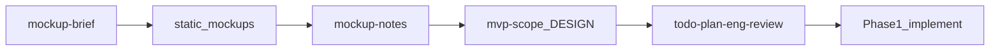

# 목업 우선 기획·구현 계획

## 기본 결정 (선호 미지정 시)

- **목업 형태:** 정적 HTML/CSS (`mockups/`) — 기획 검증에 충분하고 코드 낭비 최소
- **IA:** 달력 중심 1화면 + 할일 편집/설정은 오버레이·사이드 패널로 연결 (엑셀의 「달력 메인 + 할일 시트」 감각)
- 다른 선호(React 클릭 목업 / 분리 페이지)가 있으면 확정 전에 알려주시면 반영

## 목표

엑셀 기능을 **코드 아키텍처 없이** 화면으로 먼저 합의해, 이후 Phase 1 본구현에서 재작업을 줄인다.

검증할 것:

- 정보 계층: 일차 셀(아이콘 · 표시 · 제목 · 진행률 · overflow)
- 핵심 루프 UX: 할일 입력 감각 ↔ 달력 반영이 한 흐름으로 읽히는지
- 필터/통계를 MVP에 넣을지, 어디에 둘지 (목업에 “자리만” 두거나 빼며 판단)
- 밤티 없는 시각 방향 (토큰·타이포·분위기)

## 작업계획서 개정

[docs/작업계획서.md](docs/작업계획서.md)의 Phase 0을 아래로 바꾼다.

```
Phase 0a  목업 브리프 + 초안 DESIGN 토큰
Phase 0b  목업 페이지 구현·리뷰 루프  (← 지금 집중)
Phase 0c  mvp-scope / DESIGN.md / 기능 메모 확정
Phase 0d  eng-plan + todo-spec (목업에서 합의된 것만)
Phase 1+  본구현 (기존 T1… 유지, 목업 합의 반영)
```

원칙 추가: **목업 합의 전 React 앱 골격·스토어 본구현 금지.** 목업은 throwaway 가능, 토큰·IA만 본구현으로 이전.

## 목업 산출물

디렉터리: `mockups/`

| 파일 | 역할 |
|------|------|
| `index.html` | 진입·화면 링크·리뷰 체크리스트 |
| `calendar.html` | 월간 달력 메인 구성 (샘플 데이터 하드코딩) |
| `todo-panel` 상태 | 달력에서 열리는 할일 작성/편집 UI (별도 html 또는 동일 페이지 섹션) |
| `settings.html` | 구분·아이콘 매핑 |
| `css/tokens.css` | 색·타입·간격 변수 (본구현 DESIGN 초안) |
| `css/mock.css` | 레이아웃·컴포넌트 |
| `docs/mockup-notes.md` | 리뷰에서 나온 디자인/기능 결정 로그 |

필터·통계: 달력 화면 하단에 **접이식/조용한 스트립 플레이스홀더**만 두고, 리뷰에서 P0 유지 vs P1 이관을 결정.

## 디자인 방향 (초안, 리뷰로 수정)

밤티 회피 제약([.cursor/skills/todo-workflow/constraints.md](.cursor/skills/todo-workflow/constraints.md)) 준수.

- 분위기: 책상 위 플래너 — 린넨/세이지 워시 배경, 잉크 텍스트, 틸-잉크 액센트 (보라·크림+테라코타·다크모드 기본안 금지)
- 타이포: display `Fraunces` + UI `Karla` (Google Fonts)
- 구성: 첫 뷰포트 = 브랜드/월 네비 + 달력 그리드 하나의 구도. 카드 그리드 대시보드·통계 칩 나열 금지
- 모션 2–3: 월 전환 페이드, 일차 hover, 패널 슬라이드

샘플 데이터: 엑셀 2026-09 프로모션 할일 일부를 하드코딩해 셀 밀도·overflow를 실제처럼 검증.

## 리뷰 루프 (기능 기획 다듬기)

목업을 보며 아래를 `docs/mockup-notes.md`에 체크·결정:

1. 일차 셀에 넣을 필드 최종안 (비고는 달력에서 숨길지)
2. 하루 최대 표시 개수 N + overflow UX
3. 할일 작성 진입점 (플로팅 / 날짜 클릭 / 상단)
4. 필터·통계: 메인에 둘지 P1로 미룰지
5. 설정·만다라트·루틴 네비 노출 여부
6. 모바일: 달력 단순화 vs 리스트 우선 (목업에서 한 방향 고정)

합의 후:

- `docs/mvp-scope.md` 작성/갱신
- `DESIGN.md`로 토큰 승격
- [docs/작업계획서.md](docs/작업계획서.md) P0/P1 표 수정
- 그다음 `todo-plan-eng-review` → 본구현

## 스킬 연결



- 목업 구현 중: `todo-design-consultation` 요지(토큰)를 가볍게 적용, 전체 gstack 장문 플로우는 목업 1차 후 필요 시
- 목업 안정화 후: `todo-design-review`로 시각 검수
- 본구현 전: `todo-spec` / `todo-plan-eng-review`

## 구현 순서 (승인 후 Agent에서)

1. [docs/작업계획서.md](docs/작업계획서.md)에 Phase 0a–0d(목업 우선) 반영
2. `docs/mockup-brief.md` + `DESIGN` 초안 토큰
3. `mockups/` HTML·CSS 구현 (calendar 메인 → settings → 할일 패널)
4. 브라우저로 열어 확인 포인트 정리
5. 사용자 피드백 반영 루프 → scope/DESIGN/계획서 확정

## 명시적 비범위 (이번 구간)

- React/Vite 앱 골격, localStorage 도메인, 배포
- 만다라트·루틴 완성 UI (원하면 네비에 “준비 중”만)
- 엑셀 피벗 UI 복제
