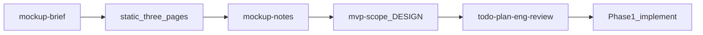

# 목업 우선 기획·구현 계획

## 확정 결정

- **목업 형태:** 정적 HTML/CSS (`mockups/`) — 디자인·화면 구성 빠르게 반복
- **IA:** **달력 / 할일 / 설정 분리 페이지** (공통 상단 네비로 이동, 엑셀 시트 전환 감각)
- React 클릭 목업·단일 화면 패널 IA는 사용하지 않음

## 목표

엑셀 기능을 **코드 아키텍처 없이** 화면으로 먼저 합의해, 이후 Phase 1 본구현에서 재작업을 줄인다.

검증할 것:

- 정보 계층: 일차 셀(아이콘 · 표시 · 제목 · 진행률 · overflow)
- 핵심 루프 UX: **할일 페이지에서 입력**한 내용이 **달력 페이지**에서 어떻게 읽히는지 (정적 샘플로 양방향 대응 관계 명시)
- 3페이지 네비 정보 구조가 엑셀 시트 분리와 맞는지
- 필터/통계를 MVP에 넣을지, 어느 페이지에 둘지
- 밤티 없는 시각 방향 (토큰·타이포·분위기)

## 작업계획서 개정

[docs/작업계획서.md](docs/작업계획서.md)의 Phase 0을 아래로 바꾼다.

```
Phase 0a  목업 브리프 + 초안 DESIGN 토큰
Phase 0b  목업 페이지 구현·리뷰 루프  (← 지금 집중)
Phase 0c  mvp-scope / DESIGN.md / 기능 메모 확정
Phase 0d  eng-plan + todo-spec (목업에서 합의된 것만)
Phase 1+  본구현 (기존 T1… 유지, 목업 합의 반영 · 라우트도 3페이지 기준)
```

원칙 추가: **목업 합의 전 React 앱 골격·스토어 본구현 금지.** 목업은 throwaway 가능, 토큰·IA(3페이지)만 본구현으로 이전.

## 목업 산출물

디렉터리: `mockups/`

| 파일 | 역할 |
|------|------|
| `index.html` | 진입·3화면 링크·리뷰 안내 |
| `calendar.html` | 월간 달력 전용 페이지 (샘플 데이터 하드코딩) |
| `todos.html` | 할일 목록·작성/편집 폼 전용 페이지 |
| `settings.html` | 구분·아이콘 매핑 전용 페이지 |
| `css/tokens.css` | 색·타입·간격 변수 (본구현 DESIGN 초안) |
| `css/mock.css` | 공통 네비·레이아웃·컴포넌트 |
| `docs/mockup-notes.md` | 리뷰에서 나온 디자인/기능 결정 로그 |

공통: 세 페이지 모두 동일한 **상단 네비** (`달력 | 할일 | 설정`, 현재 페이지 강조).

페이지별 역할:

- **달력:** 월 네비 + 7열 그리드 + 일차 셀 정보 계층. 날짜 클릭은 목업에서 `todos.html`로 링크(쿼리 자리만, 동작은 정적).
- **할일:** 테이블/리스트 + 우측 또는 하단 폼. 엑셀 `할일표` 컬럼 반영. 파생 필드(표시·상태)는 읽기 전용으로 보여 기획 검증.
- **설정:** `구분표` 행 편집 UI.

필터·통계: **달력 페이지** 하단에 접이식/조용한 스트립 플레이스홀더만 두고, 리뷰에서 P0 유지 vs P1 이관·할일 페이지 이관 여부를 결정.

## 디자인 방향 (초안, 리뷰로 수정)

밤티 회피 제약([.cursor/skills/todo-workflow/constraints.md](.cursor/skills/todo-workflow/constraints.md)) 준수.

- 분위기: 책상 위 플래너 — 린넨/세이지 워시 배경, 잉크 텍스트, 틸-잉크 액센트 (보라·크림+테라코타·다크모드 기본안 금지)
- 타이포: display `Fraunces` + UI `Karla` (Google Fonts)
- 구성: 각 페이지 첫 뷰포트 = **그 페이지 하나의 목적** (달력 페이지는 브랜드/월 + 그리드만; 할일·설정에 통계 카드 나열 금지)
- 모션 2–3: 월 영역 페이드, 일차 hover, 네비/페이지 전환 시 짧은 fade-in

샘플 데이터: 엑셀 2026-09 프로모션 할일을 **달력·할일 페이지에 동일 세트로** 하드코딩해 대응 관계를 검증.

## 리뷰 루프 (기능 기획 다듬기)

목업을 보며 아래를 `docs/mockup-notes.md`에 체크·결정:

1. 일차 셀에 넣을 필드 최종안 (비고는 달력에서 숨길지)
2. 하루 최대 표시 개수 N + overflow UX
3. 할일 작성 진입점 (할일 페이지 폼 vs 달력→할일 딥링크)
4. 필터·통계: 달력/할일/P1 중 어디
5. 설정·만다라트·루틴 네비 노출 여부 (설정만 둘지)
6. 모바일: 달력 단순화 vs 할일 리스트 우선

합의 후:

- `docs/mvp-scope.md` 작성/갱신
- `DESIGN.md`로 토큰 승격
- [docs/작업계획서.md](docs/작업계획서.md) P0/P1·라우팅(3페이지) 표 수정
- 그다음 `todo-plan-eng-review` → 본구현

## 스킬 연결



- 목업 구현 중: `todo-design-consultation` 요지(토큰)를 가볍게 적용
- 목업 안정화 후: `todo-design-review`
- 본구현 전: `todo-spec` / `todo-plan-eng-review` (라우트: `/` 달력, `/todos`, `/settings`)

## 구현 순서 (승인 후 Agent에서)

1. [docs/작업계획서.md](docs/작업계획서.md)에 Phase 0a–0d(목업 우선) + **3페이지 IA** 반영
2. `docs/mockup-brief.md` + `tokens.css` / DESIGN 초안
3. `mockups/` 구현 순서: 공통 네비·토큰 → `calendar.html` → `todos.html` → `settings.html` → `index.html`
4. 브라우저로 확인 포인트 정리
5. 피드백 반영 루프 → scope/DESIGN/계획서 확정

## 명시적 비범위 (이번 구간)

- React/Vite 앱 골격, localStorage 도메인, 배포
- 단일 페이지 패널/오버레이 IA
- 만다라트·루틴 완성 UI (원하면 네비에 “준비 중”만)
- 엑셀 피벗 UI 복제
