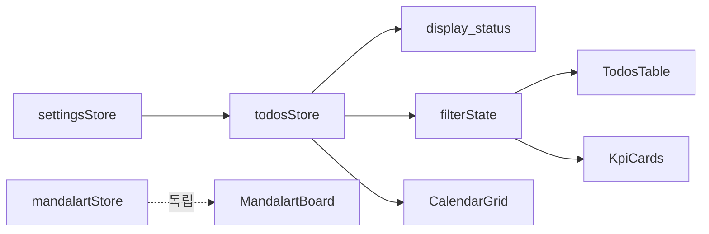

# 목업 범위 본구현 계획

## 범위 (목업 = 구현 대상)

| 화면 | 구현할 기능 |
|------|-------------|
| 설정 | 구분·아이콘 CRUD (일정/할일/회의 시드) |
| 할일 | 표 CRUD, 표시·상태 파생, 진행률 바, 날짜·구분·우선순위·카테고리·상태 필터, KPI 카드(건수·완료율·우선순위 분수 바), Note, Check List |
| 달력 | 연/월/시작일(일·월), SUN/SAT 헤더, 날짜별 할일 투영(아이콘·점·제목·진행), 오늘 강조 |
| 만다라트 | 9×9 입력, 중앙 세부↔외곽 중앙 미러 동기화, localStorage |

**이번 제외:** 검색, 프로젝트/간트/D-day, 주간회고, 능력치, 질문카드, 달력 8↔16 토글, 배포.

**진행률 규칙 (통일):** `0~100` 정수. 미입력/0→시작전, 1~99→진행중, 100→완료. (기획의도 원문 기준; UI는 % 바와 입력 필드)

## 스택 (확정)

- React 19 + Vite + TypeScript
- React Router (`/`, `/todos`, `/mandalart`, `/settings`)
- CSS: 목업 [`mockups/css/tokens.css`](mockups/css/tokens.css) + [`mockups/css/mock.css`](mockups/css/mock.css)를 `src/styles/`로 이전·정리 (UI 키트 없음)
- 상태: React Context + `localStorage` (키 예: `desklist/v1`)
- 날짜: 네이티브 `Date` + `YYYY-MM-DD` 문자열 정규화

앱 루트: `d:\Workspace\To-do-list\` (기존 `docs/`, `mockups/` 유지)

## 아키텍처



```
src/
  domain/       types, derive(priority→display, progress→status), monthGrid
  data/         load/save localStorage, seed
  state/        AppStore context (settings, todos, note, habits, mandalart, calendarView, filters)
  features/     calendar, todos, settings, mandalart
  ui/           Layout, Nav
  styles/       tokens.css, app.css (목업 기반)
  app/          main, router
```

## 구현 순서

### 1. 스캐폴딩
- `npm create vite@latest . -- --template react-ts` 방식 또는 수동 `package.json` (기존 docs/mockups와 공존)
- Router, Layout(네비 4링크), 토큰 CSS 연결
- [`docs/eng-plan.md`](docs/eng-plan.md)에 위 범위·폴더 한 페이지로 기록

### 2. 도메인 + 저장소
- 타입: `Todo`, `TypeSetting`, `Priority`, `Status`, `MandalartCell`, `HabitRow`
- `priorityToDisplay`, `progressToStatus`
- `buildMonthCells(year, month, weekStartsOn)`
- seed: 목업/엑셀 프로모션 샘플 + 구분 3종

### 3. 설정 페이지
- 목록 편집·추가·삭제 → store 반영
- 할일 구분 드롭다운이 이 목록을 사용

### 4. 할일 페이지 (핵심 루프)
- 필터된 목록 테이블 + 선택 행 편집 폼
- KPI: 필터 결과로 전체/시작전/진행중/완료, 완료율, 우선순위별 `완료수 / 전체수`
- Note·Check List persist
- 저장 시 달력에 즉시 반영(동일 store)

### 5. 달력 페이지
- 우측 연 스피너·월 버튼·시작일 select
- 그리드에 해당일 todos (정렬: 표시 높은 순 등 단순 규칙), 셀 클릭 → `/todos?date=`

### 6. 만다라트
- 81칸 중 역할별 입력; 세부 목표 8개 단일 소스 → 외곽 미러는 읽기 반영(또는 양방향 동일 키)

### 7. 확인
- `npm run build` 통과
- 수동: 설정 아이콘 → 할일 추가 → 달력 표시 → 필터 KPI 변화 → 만다라트 미러

## 성공 기준

1. 할일 한 건 저장 → 달력 해당 칸에 아이콘·우선순위·제목·진행 표시  
2. 연/월/시작일 변경 시 그리드 재배치  
3. 필터 변경 시 표와 KPI가 같은 집합을 사용  
4. 새로고침 후에도 localStorage로 데이터 유지  
5. 검색·프로젝트 등 미구현 화면에 코드/네비 추가하지 않음
